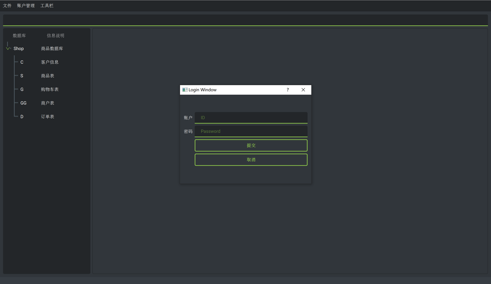

# DB Shop. A DB assignment.

## 简介

ZJGSU 数据库课程设计.

## 如何运行 ?

**MS SQL Server 设置**

开启TCP/IP服务，手动设置端口，在 `src/config/LoginCfg.json`中 `User`内添加一项如:`"NickName":"chenghua.wang","UserName":"sa","ServerName":"wang\\SQLEXPRESS","Host":"localhost","pwd":"123456","database":"Shop_release", "port":"51091"`

并把这一项移动到第一项.

**安装如下依赖包**

**Requirements.txt**

```
pymssql==2.1.5
PyQt5==5.15.6
qt_material==2.8.19
```

1. 执行 `git clone https://github.com/chenghuaWang/DBShop-DB-assignment.git`
2. 执行 `pip install -r requirements`
3. 执行 `python src/main.py`

## 运行界面


